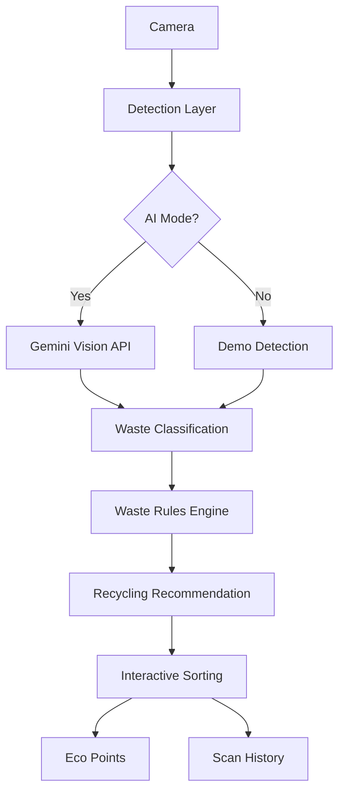

# EcoScan — Scan, Learn, Sort

An interactive AI-powered waste scanning and recycling assistant built for college project exhibitions. Scan waste items with your camera, get AI-powered classification, and learn proper disposal through an engaging drag-and-drop sorting experience.

## Features

- **AI Waste Detection** — Uses Google Gemini Vision API to identify waste items from camera images
- **Real-time Camera Scanning** — Access device camera with proper permission handling
- **Interactive Sorting** — Drag detected waste items to the correct recycling bin
- **Satisfying Animations** — Polished Framer Motion animations for scanning, detection, and disposal
- **Eco Points System** — Gamified scoring with persistent localStorage
- **Scan History** — Track previously scanned items
- **Demo Mode** — Fully functional without API key for presentations
- **Special Waste Handling** — Proper warnings for batteries, e-waste, and hazardous materials
- **Responsive Design** — Works on desktop, tablet, and mobile browsers

## Tech Stack

- **Framework:** React 18 + TypeScript
- **Build Tool:** Vite
- **Styling:** Tailwind CSS v4
- **Animations:** Framer Motion
- **AI Integration:** Google Gen AI SDK (@google/genai) with Gemini 2.5 Flash
- **Icons:** Lucide React
- **Camera API:** Browser MediaDevices API

## Project Structure

```
src/
├── components/
│   ├── common/
│   │   └── GlassCard.tsx       # Reusable UI components (GlassCard, Button, Badge, ScanLine, CornerMarkers)
│   ├── scanner/
│   │   ├── CameraView.tsx      # Camera feed with scan frame and controls
│   │   ├── DetectionOverlay.tsx # Animated bounding box overlay
│   │   └── ScanStatus.tsx      # Scanning status indicator
│   ├── waste/
│   │   ├── WasteInfoPanel.tsx  # Detailed waste information panel
│   │   └── WasteObject.tsx     # Draggable waste item with drag physics
│   ├── bins/
│   │   └── RecyclingBins.tsx   # Three recycling bins with hover/tap animations
│   └── feedback/
│       ├── SuccessAnimation.tsx # Sorting result modal with confetti
│       └── PointsAnimation.tsx  # Animated points counter
├── pages/
│   └── ScannerPage.tsx         # Main scanner experience page
├── services/
│   ├── detectionService.ts     # Detection orchestration (AI + demo modes)
│   └── geminiService.ts        # Gemini Vision API integration
├── utils/
│   └── wasteRules.ts           # Local waste classification rules
├── hooks/
│   └── useCamera.ts            # Camera permission and stream management
├── App.tsx
├── main.tsx
└── index.css
```

## Architecture



## How It Works

1. **Camera Access** — Requests camera permission on load, with fallback to demo mode
2. **Scan Trigger** — User taps "Scan" to capture a frame from the video stream
3. **AI Analysis** — Image sent to Gemini Vision API (or demo mode simulates detection)
4. **Results Display** — Bounding box appears with waste name and confidence
5. **Information Panel** — Shows material, decomposition time, environmental impact, recommended bin
6. **Three Bins Appear** — Organic (green), Recyclable (blue), Non-recyclable (red)
7. **Drag & Drop** — User drags waste item toward a bin
8. **Disposal Animation** — Item animates into bin with lid open/close, particles for correct sorting
9. **Feedback** — Correct/incorrect result with points awarded
10. **History** — Scan recorded in local history

## Demo Mode

The application automatically enters **Demo Mode** when no `VITE_GEMINI_API_KEY` is configured. In demo mode:
- Tap "Try Demo Object" to select from 9 sample waste items
- Simulates realistic detection delay (800-1500ms)
- Full sorting experience works without camera or API
- Perfect for presentations on devices without cameras

Sample demo objects: Plastic Bottle, Aluminum Can, Banana Peel, Paper, Glass Bottle, Food Waste, Plastic Bag, Battery, Cardboard

## Getting Started

### Prerequisites
- Node.js 18+
- npm or yarn

### Installation

```bash
# Navigate to project directory
cd ecoscan

# Install dependencies
npm install

# Copy environment template
cp .env.example .env

# Add your Gemini API key to .env (optional - works in demo mode without it)
# VITE_GEMINI_API_KEY=your_api_key_here

# Start development server
npm run dev
```

### Environment Variables

| Variable | Required | Description |
|----------|----------|-------------|
| `VITE_GEMINI_API_KEY` | No | Google Gemini API key from [AI Studio](https://aistudio.google.com/app/apikey). Demo mode works without it. |

### Building for Production

```bash
npm run build
```

Output will be in the `dist/` directory.

## Camera Requirements

- **HTTPS or localhost** — Browser camera API requires secure context
- **Permission** — User must grant camera access
- **Mobile Support** — Works on Android Chrome, iOS Safari 14+
- **Fallback** — Demo mode works without camera

## Gemini API Setup

1. Go to [Google AI Studio](https://aistudio.google.com/app/apikey)
2. Create a new API key
3. Add to `.env` file: `VITE_GEMINI_API_KEY=your_key_here`
4. Restart dev server

**Security Note:** Frontend API keys are visible in browser applications. For production deployments, use a backend/serverless proxy to protect credentials.

## Waste Classification Rules

The app uses a local rule engine (`src/utils/wasteRules.ts`) that maps detected items to disposal categories:

| Category | Bin | Examples |
|----------|-----|----------|
| Recyclable | Blue ♻️ | Plastic bottles, aluminum cans, paper, cardboard, glass |
| Organic | Green 🌱 | Food waste, banana peels, vegetable scraps |
| Non-recyclable | Red 🗑️ | Plastic bags, film, contaminated items |
| Special Disposal | Amber ⚠️ | Batteries, electronics, light bulbs |

## Future Improvements

- [ ] Replace Gemini with on-device YOLO model for offline detection
- [ ] Add barcode scanning for product-specific recycling info
- [ ] Community-sourced recycling location finder
- [ ] Multi-language support
- [ ] PWA installation for offline demo mode
- [ ] Admin dashboard for waste rule management
- [ ] Integration with municipal recycling APIs

## License

MIT License — Built for educational/demo purposes.

## Credits

- **Design:** Custom eco-tech aesthetic with green/blue/red semantic color system
- **Animations:** Framer Motion for production-quality micro-interactions
- **AI:** Google Gemini 2.5 Flash for vision understanding
- **Icons:** Lucide React + Unicode emojis for waste items
